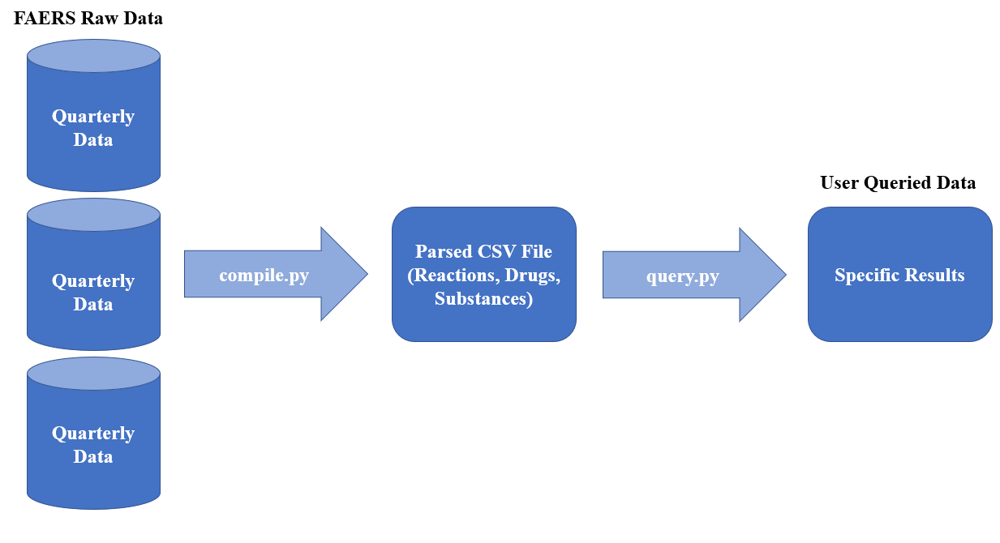
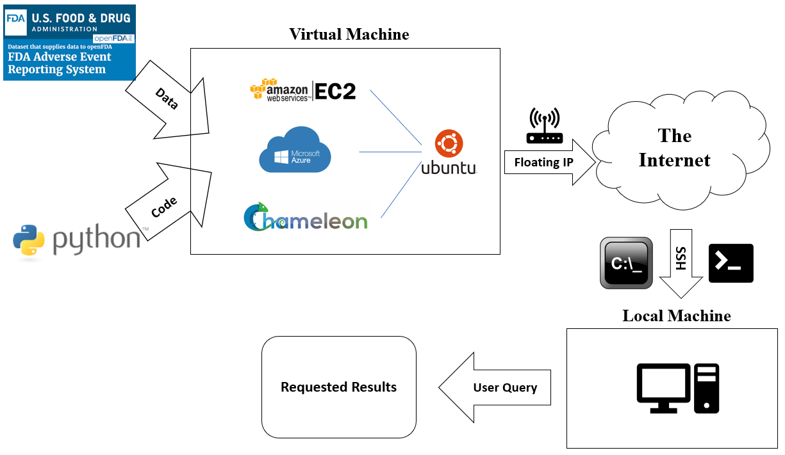
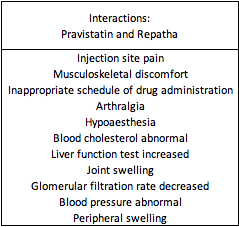
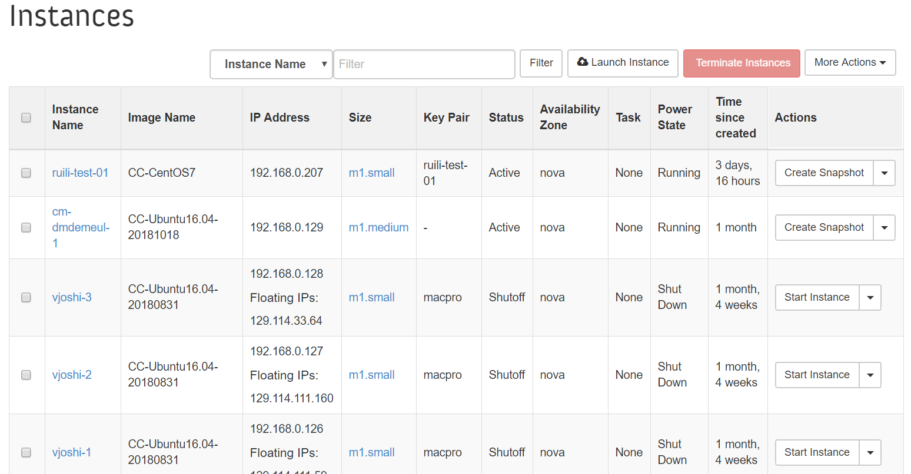
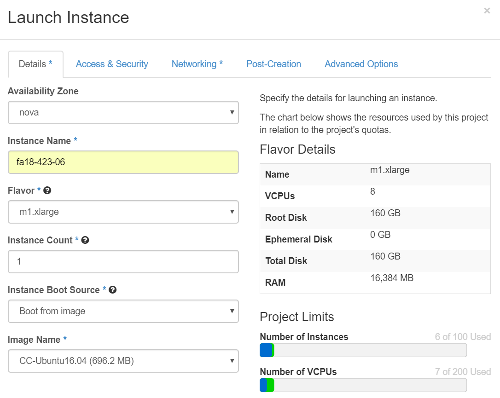
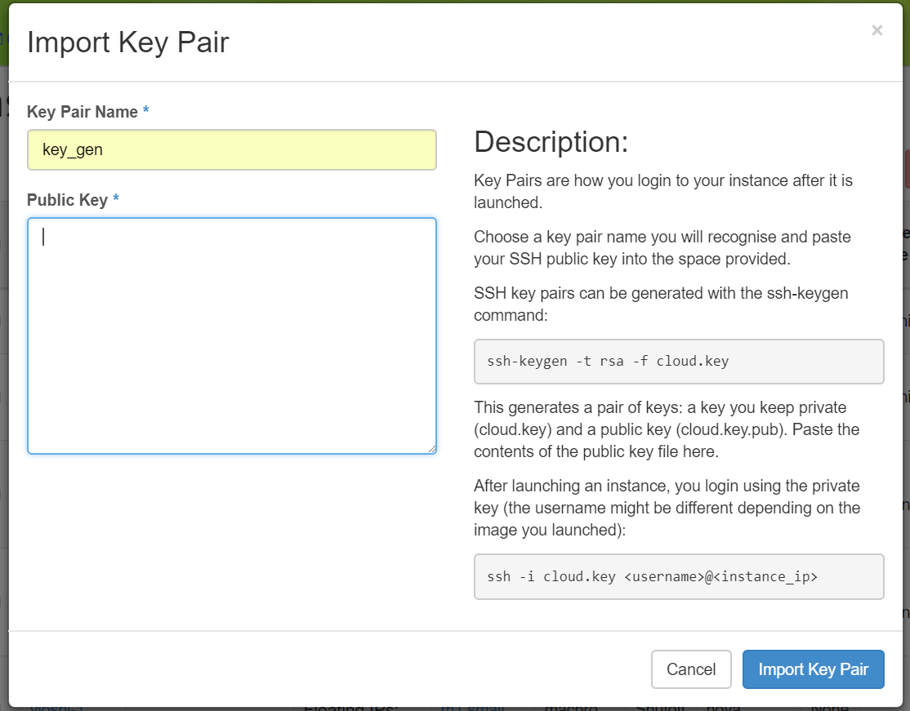
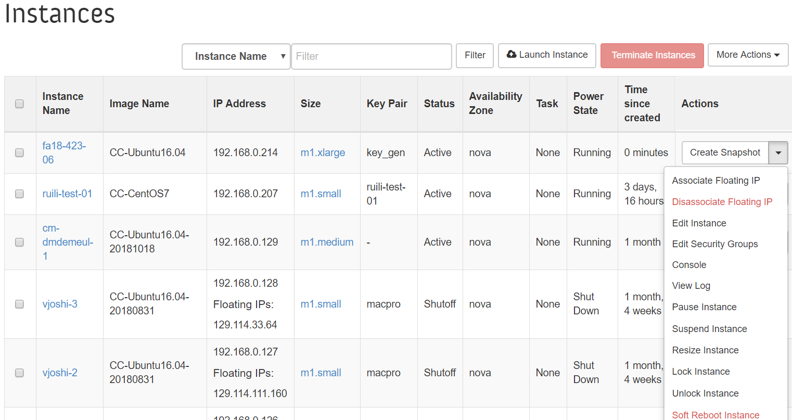

# Automation on Drug Interactions Profiling :smiley: fa18-423-06 fa18-423-03 fa18-423-02 fa18-423-05

| Yixing Hu, Kelvin Liuwie, Chandler Mick, Omkar Tamhankar
| yixihu@gmail.com, kliuwie@gmail.com, chmick@iu.edu, otamhank@iu.edu
| Indiana University
| hid: fa18-423-02 fa18-423-03 fa18-423-05 fa18-423-06
| github: [:cloud:](https://github.com/cloudmesh-community/fa18-423-03/blob/master/project-report/report.md)
| code: [:cloud:](https://github.com/cloudmesh-community/fa18-423-03/blob/master/project-code/README.md)

**:mortar_board: Learning Objectives**

* Creating a program that can parse and query large data sets
* Exploring various "free" cloud servers to run our program
* Evaluating which cloud server provides the optimal working efficiency
* Learning how to use cloud computing

---

**Keywords**: Chameleon Cloud, Microsoft Azure, Amazon Web Services, EC2, Cloud,
Drugs Interactions, FAERS, Python, Ubuntu

---

## Introduction

We created a Python program that took raw data from the United
States Food and Drug Administration's Adverse Event Reporting System (FAERS) and
filtered out important components for a user to query the information simply.
The main issue that we noticed was that the important information that the Food and
Drug Administration (FDA) was collecting was in large datasets that incredibly
difficult to breakdown analyze for the average users of the information. Users
of this information could be regulators, doctors, or even concerned consumers.
Therefore, we believe that our program simplifies the analysis of these big data
sets that are provided by the FDA and makes them fit for spreadsheets, such as
Excel, for more in-depth review of the drug data.

One of the most important issues in the pharmaceutical industry today is
determining the quality of a drug on the market [@www-PharmTech]. Currently
a pharmaceutical company needs only prove in human clinical trials that a drug
is safe when taken in isolation. However, humans are not basic research subjects
and are often taking a number of medications. As the state of the healthcare
system continues to fall victim to political cycles, it is always important to
make sure that information on the safety and effects of drugs on the market need
to be readily and easily available for review. We hope that our project
represents an example of what could be implemented in the marketplace to present
the information to those who need to be aware of the effects of the drugs that
they are interacting with.

## Dataset

The dataset is an Extensible Markup Language (XML) file from the FAERS on the
FDA's website. FAERS is a collection of reports from doctors, nurses, and
patients who have reported to the FDA side-effects of using certain commercial
drugs [@www-FAERS-Website]. This data is used by the FDA to formulate warnings
and regulations against drugs to warn consumers of the potential side effects
that come about from using pharmaceutical drugs.

The publicly available XML file is a 112 MB file with over 16 million rows of
data. Therefore, the file cannot be easily evaluated and assessed without
creating some sort of program to trim out the unnecessary data and store the
valuable data for running the query. The data that we analyzed with our program
covers the months of July 2018 to September 2018. However, a user would most
likely want to analyze data from previous quarters, which is possible with our
program.

The XML file contains 67 tags for each "adverse event report." An adverse event
report is a negative side effect to a drug from anything including migraines to
something as serious as death. Every tag includes information about the patient,
the side effect, the drug, treatment duration, etc. For this project, we decided
the most important tags that would want to be accessed would be the
reactionmeddrapt, medicinalproduct, and activesubstancename. These relate to the
reactions from the drug(s), the name of the drug, and the substances in the drug,
respectively.

## Implementation

### Code Structure

+@fig:01-design depicts the workflow of our program as a whole. compile.py is
taking the quarterly data from the website and parsing the data and compiling
the data into a .csv file. Then, query.py is allowing a user to query the data
that they are looking for from the database.

{#fig:01-design}

#### Code README file

To access our program's README file and gain an understanding of the look and
process of our code, go to [this
website](https://github.com/cloudmesh-community/fa18-423-03/blob/master/project-code/README.md).

#### parser.py

Our parser.py file takes an XML file containing the initial FAERS raw data from
the website and converts it to a dataframe format to be stored in a CSV file.
This initial parse separates the three tags that we are looking to store for
our program (reactionmeddrapt, medicinalproduct, and activesubstancename). The
parser.py program flows into the compile.py program where the dataframe format
allows the data to be easily manipulated.

#### compile.py

Our compile.py file takes an XML file containing the initial FAERS raw data from
the website and converts the selected data to a CSV file. Using the parsing.py
function, the function takes our dataframe data and outputs the three tags that
we used in our project. This program takes the original, large dataset and forms
a smaller, compact dataset with the data that we deemed important.

#### query.py

Our query.py file takes the compiled CSV file and allows a user to return
certain data based on inputted values. These inputted values can be certain
drugs, substances within the drugs, or the reactions of the drugs. This user
queried data can be used by the user to evaluate the specific results that they
are looking for. This CSV file can be transferred to a spreadsheet for simple
data analysis.

The main purpose behind this code is to allow healthcare practitioners to be
able to find patients who have had reported adverse side effects to drug or
substance combinations similar to their patient. For example, if a patient were
to have a history of intense fatigue and headaches while taking Crestor and
Repatha, a healthcare practitioner could use our query to search for a drug
combination that does not have the reported adverse side effects of headaches
and fatigue yet combats the same target health issue.

### Technologies Used

#### Python Packages

* **pip:** package manager that is used to download pandas. Ensure that the most
recent version is downloaded.
  - ```pip install --upgrade pip```

* **pandas:** Python package that allows our program to put our data in
datatable format.
  - *In AWS:* ```pip3 install pandas --user```
  - *In Chameleon Cloud:* ```pip3 install pandas --user```
  - *In Azure:* ```pip3 install pandas```

#### Amazon Web Services (AWS) EC2

AWS EC2 [@www-Amazon-Free] is a cloud service that acted as a virtual machine
that stored, ran, and transferred our code and its results. A free trial version
with limited performance features was used to test our code.

#### Chameleon Cloud

Chameleon Cloud [@www-Chameleon-Cloud] is a cloud service that acted as a
virtual machine that stored, ran, and transferred our code and its results. This
cloud compute was provided to us for free for academic purposes by the National
Science Institute.

#### Microsoft Azure

Microsoft Azure [@www-Azure-Free] is a cloud service that acted as a virtual
machine that stored, ran, and transferred our code and its results. A free trial
version with limited performance features used to test our code.

#### Cyberduck

Cyberduck [@www-Cyberduck] is a FTP and SFTP service that was used
to transfer our program files from our local machine to the virtual machines.
Cyberduck is free with any platform.

#### Ubuntu 18.04

Ubuntu 18.04 [@www-Ubuntu] is the operating system that we ran all of our
program code on through the virtual machine and a local machine.

#### Mac Operating System (OS)

Mac OS [@www-Mac-OS] is the operating system that we ran on our local machines
to test the program code.

### Prerequisites

To run our program, the following would be needed to use the technologies
mentioned above.

#### AWS Account

An AWS account is necessary to run their EC2 server. To get an account, go to
[this website](https://aws.amazon.com/) and follow the instructions. The free
trial version was used for our tests.

#### Chameleon Cloud Account

A Chameleon Cloud account is necessary to access their server. To get an
account, go to [this website](https://www.chameleoncloud.org) and sign up for
the free service. However, you will need PI Eligibility or have the permission
of a PI. A PI must be a researcher or faculty of an academic institution, part
of a federal agency, or related to an independent research facility associated
with educational purposes. Essentially, the server is meant to provide free
access for educational and development purposes, as opposed to for-profit
purposes.

#### Microsoft Azure Account

An Azure account is necessary to access their cloud server. To get an account,
go to [this website](http://portal.azure.com/). Initial access is free, but
Microsoft incorporates a "pay as you go" structure to provide users with greater
needs of computing power access if necessary.

### Architecture

Overall, the architecture of our tests is depicted in +@fig:02-architecture.
Data files and program code were loaded to the virtual machines through
Cyberduck. Then, AWS EC2, Chameleon Cloud, and Microsoft Azure were tested to
find out which service offered the best environment to run our program code
efficiently. Then, this data was accessed by the user through a local machine
using console commands.

{#fig:02-architecture}

## Results

As shown by our results, there are a few similarities and differences to note
when deciding what platform to use when executing our program. The Terrans Force
T5 computer by far outperformed all the other machines both in run times for
compiler.py and query.py. Notably, the Terrans Force T5 outperformed the other
three machines on every single query execution. Two of the other machines had
the same amount of RAM as the T5, therefore its superior run times may be on
account of the more powerful Intel processor that it held. The other three
machines exhibited similar run times. Interestingly, the two instances we ran on
Chameleon Cloud had 8 GB of RAM and 16 GB of RAM, respectively, but there was no
significant difference in run time between them.

Although, these results are difficult to extrapolate to all computer forms,
based on our results, our program runs best on local machines that have both
high RAM and powerful processors. However, users may not want to take up their
own hard disk space with these large data files, therefore we recommend running
on a virtual machine with minimum 8 GB of RAM. 

The services that were offered through Amazon Web Service and Microsoft Azure
were "free trials," where we were limited to a certain number of hours or days
that we were able to access. However, this also limits the amount of computing
power we able to access through their programs. AWS only allows 1 GB of memory
for their free trial version, a mark that was well over the datasets that we
were working with. Microsoft Azure has a similar pricing structure where you
actually have different tiers for computing power (RAM) and storage space
[@www-Azure-Pricing].

The issues with Microsoft Azure and Amazon Web Services Cloud Servers proved to
be issues that were brought about by having a dataset that was too large for the
free trial versions of the software. We firmly believe that our program would be
able to work with ease using our implementation procedures and spending the
extra money to access a higher quality version of the same services that we
tested.Services such as Azure and AWS offer a wide range of virtual machine 
options so it is up to the user how much they are willing to pay for speed and 
processing power.

## Clincally Relevant Findings 

Repatha produced by Amgen is a PCSK9 inhibitor designed to attack
and inactivate PSCK9 proteins and result in lowered LDL cholesterol
[@fa18-423-03-repatha]. This drug was approved by the FDA in January 2015,
therefore it is a relatively new drug for treating hyperlipidemia. According to
PDR.net, Repatha has no interactions with other drugs [@fa18-423-03-repatha].
When running our program, however, we found that Repatha has an interaction
with Pravastatin another cholesterol lowering medication. However, we did not
find any adverse event reports tying Repatha and Lipitor (Atorvastatin) a
different cholesterol lowering medication. +@fig:0-side-effects
shows our results tying the adverse events of patients taking both Repatha and
Pravastatin, but no other drugs. 

{#fig:0-side-effects}

PSCK9 inhibitors are generally prescribed in
combination with a statin drug so healthcare providers should be aware of the
possible interactions between these two classes of drugs [@fa18-423-03-repatha].
Therefore, the novelty produced by our program is that healthcare professionals
are able to take the most up-to-date adverse events published by the FDA and
check for drug interactions of recently released drugs. This database in
combination with our program gives healthcare professionals the power to skip
the latency period for enough adverse events to occur for drug companies to
relay that information to the healthcare providers. Ultimately, this can save
patients from facing unnecessary interactions, whether they be in the form of
major or minor side effects.

## Conclusion

At the beginning of this project, we had a goal to find a way to take the
massive datasets provided by the FDA and turn them into files that can be easily
queried by a user for further data analysis. At the same time, we wanted to be
able to explore the possibility and usefulness of Cloud Servers to run our
program so it does not have to be limited to being accessed via a local machine.
While we can firmly say that we have made a program that provides the services
we set out to create, we can say to a degree of certainty that we have found
that it can be ran on a cloud server. The service that we used successfully was
Chameleon Cloud however for the average user, the two services that we found to be
favorable were Amazon Web Service's EC2 and Microsoft Azure's Cloud Shell. In
terms of usability and reliability, we believe that a paid subscription to AWS
EC2 would be the better of the two.

## Work Breakdown

* Yixing Hu: Microsoft Azure Server Testing, Query Code Editor
* Kelvin Liuwie: Parsing, Compile, and Query Code Writer
* Chandler Mick: Report Writer, Chameleon Cloud Testing, Query Code Editor
* Omkar Tamhankar: AWS Server Testing, Chameleon Cloud Testing, Medical Advisor

## Appendix

### Chameleon Cloud

**Overview:**

This document explains how to access Chameleon Cloud and how it
was used to run the program in the cloud server [@www-Chameleon-Cloud].

**Setup**

Go to https://www.chameleoncloud.org and sign up for the free service. However,
you will need PI Eligibility or have the permission of a PI. A PI must have be a
researcher or faculty of an academic institution, a part of a federal agency, or
an independent research facility associated with educational purposes.
Essentially, the server is meant to provide free access for educational and
development purposes, as opposed to for-profit purposes.

After obtaining proper access, you are free to create an instance on the server
to create your virtual machine.

**Creating an Instance**

When creating our instance, the easiest way to get to the instances database was
to use this website:

```https://openstack.tacc.chameleoncloud.org/dashboard/project/instances/```

Here, you should all the instances created in your project. The webpage should
resemble +@fig:0-instance-database:

{#fig:0-instance-database}

From here, you must select the "Launch Instance" button. This should bring up a
webpage that resembles +@fig:0-instance-details. Here, you must enter a name for your
instance. We used a group member's HID as an example (fa18-423-06). Flavor
describes the amount of resources that will be allocated to the project.
Resources such as RAM, disk space, etc. It is important to have at least **16**
**GB** of RAM to run our project.py program because of the size of the files
that are being processed. The "Instance Boot Source" must be set to "Boot from
image." We used Ubuntu 16.04 for our "Image Name" due to the ease of running
commands through the terminal later.

{#fig:0-instance-details}

Next, click on the "Access & Security" tab. Here, you want to create a key pair
to link the virtual machine to your computer. To do this, you must click on the
"+" button next to the drop down. You should get a pop up that looks like 
+@fig:0-key-pair:

{#fig:0-key-pair}

You can name the key however you like. To generate and access your public key,
enter the following commands on Terminal:

```ssh-keygen -t rsa -f <insert your key name>```

This should result in a file being created containing information on your public
and private keys. To access the public key  enter the following command:

```$ cat ~/.ssh/<public key file name>```

Copy and paste the returned key value into the text box labeled "Public Key" in
Chameleon Cloud. Now, you are ready to launch the instance. So, click the
"Launch Instance" button on the bottom of the dialog box. The instance should
now appear in the database and take a few minutes to spawn and become active.
Now, you must associate a floating IP address with the instance to access the
instance. So, click on the "Associate Floating IP" button (see +@fig:0-floating-ip).

{#fig:0-floating-ip}

Here, you may either add a custom IP address, or just use one of the ones given
in the drop down. We chose the latter. Either way, you must remember this IP
address to later access the instance through commands in Terminal. Then, leave
the "Port to be associated" section be. Now, you are ready to associate the IP
address so click the button to do so. Now, the instance is created and ready to
run our program!

### Amazon Web Services (AWS) EC2 Usage

**Overview:**
This document explains how to access AWS EC2 and how it was used to run the
program in the cloud server [@www-Amazon-Free].

**Setup**
Go to https://aws.amazon.com/. Click on "Sign In to the Console". If you do not
already have an account set up, create an account. In the "AWS services" search
bar, search "EC2" and click on the EC2 option. Under "Create Instance" click
"Launch Instance". Click the "Select" button next to "Amazon Linux 2 AMI (HVM),
SSD Volume Type". Click on "Review and Launch" then "Launch". In the drop-down
menu select "Create a new key pair", type in a key pair name, click "Download
Key Pair", select the check box below, and click "Launch Instance". In the green
box at the top of the screen click on Instance ID link, this will open the
instance.

**Accessing the instance**
Open command prompt, if using Windows, or Terminal, if using Mac. Type in: 

```ssh -i ~/*key-pair-location*   ec2-user@*IPv4 Public IP*```

This will connect you into the EC2 instance.

**Uploading files into the instance**
Download Cyberduck 2. Open the application. In the dropdown menu, select "SFTP
(SSH File Transfer Protocol)". In the Server field, enter the Public DNS. In the
Username field enter "ec2-user" [@fa18-423-03-cyberduck-ec2]. In the SSH Private
Key field select "Choose" from the dropdown menu and select your .pem key pair
file. Click on "Connect". Once connected through Cyberduck, you can simply drag
and drop files into the instance.

**Disclaimer** 
Our .xml files were greater than 1 GB in size. AWS EC2's free tier only offers
up to 1 GB memory therefore we would receive memory errors when running our
python files on the server.

### Microsoft Azure Cloud Shell Usage

**Overview:**
This document explains how to access Microsoft Azure and how Azure is used to
run programs in the cloud server [@www-Azure-Free].

**Setup** 
Go to https://portal.azure.com/ to register an Azure account. Once you get an
account, you can go to Azure Portal to access all the tools you need. The search
bar at the very top could help you access any resource you need in Azure.

**Create a Python web app through Azure app services**  
First, clone the folder containing code files and data files from Github with
Bash/Terminal in your local machine. Before further operation, run the Python
files locally to check if the program runs correctly. Then, go back to the Azure
portal which was accessed previously. There, you will open the Cloud Shell for
the rest of your operations. The very first step in the Cloud Shell is to create
a deployment user, if you do not already have one. The command should read:

```az webapp deployment user set --user-name <username> --password <password>```

where `<username>` and `<password>` are replaced with the username and password you
are planning to use. After this command is ran successfully, there should be a
JSON output with your password shown as null. The username and the password
should be recorded for future use. After that, you have to create a resource
group to make it easier to manage, by using the command:

  ```az group create --name myResourceGroup --location "East US"```

For this command, "East US" could be replaced by other regions where Azure is
available, but for the connection stability, it would be best to use the closest
region. Then, an Azure App Service plan should be created. The command should
read:

  ```az appservice plan create --name myAppServicePlan --resource-group myResourceGroup --sku B1 --is-linux```

When those steps are done, it is the time to create the web app. Still working
on the Azure Cloud Shell, type the following command lines:

  ```az webapp create --resource-group myResourceGroup --plan myAppServicePlan --name <app_name> --runtime "PYTHON|3.7" --deployment-local-git```

These command lines should return an output starting with:

  ```Local git is configured with url of 'https://<username>@<app_name>.scm.azurewebsites.net/<app_name>.git'```

This URL of git should be kept as you will need it later for connection.

After those steps, go back to local bash for the following operations. The first
step is to add an Azure remote to the local Git repository by using the command:

  ```git remote add azure <deploymentLocalGitUrl-from-create-step>```

And then use:

  ```git push azure master```

to push to Azure from Git repository. This command should take a bit longer to
process. Once the processing is done, you can go back to the Azure Portal to
access the App Services to find the one being created. Click on that service and
go to the side bar to click on the SSH under Development Tools. Then, you
can access all the files you have pushed onto the cloud server.


